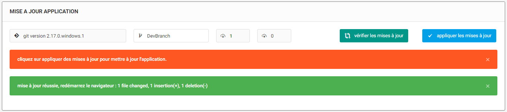

# Git-current-branch-update
get the current branch and make pull PHP class



## First Class [GitCls.php]
```php
require_once('./GitCls.php');
$git = new Git;

echo $git->Branch();
// will show cuurent branch

echo $git->Version();
// will show git version

$git->Fetch();
$res = $git->Git_Count();
// will get array() with count of in and out commit not applied

$pu =  $git->Pull();
echo json_encode(array('pumsg' =>$pu ));
// Pull and show result
```
## Second Class [GitRepos.php]
```php
require_once('./GitRepos.php');

//Windows Exemple
Git::windows_mode();
$repo = Git::open('C:\xampp\htdocs\MyRepo');

echo $repo->active_branch();
// will show cuurent branch

echo $repo->Version();
// will show git version

$res = $repo->Count_Commits();
// will return array() with count of in and out commit not applied

$pu =  $repo->pull("origin","master"); // ("remote","branch")
echo json_encode(array('pumsg' =>$pu ));
// Pull and show result
```
